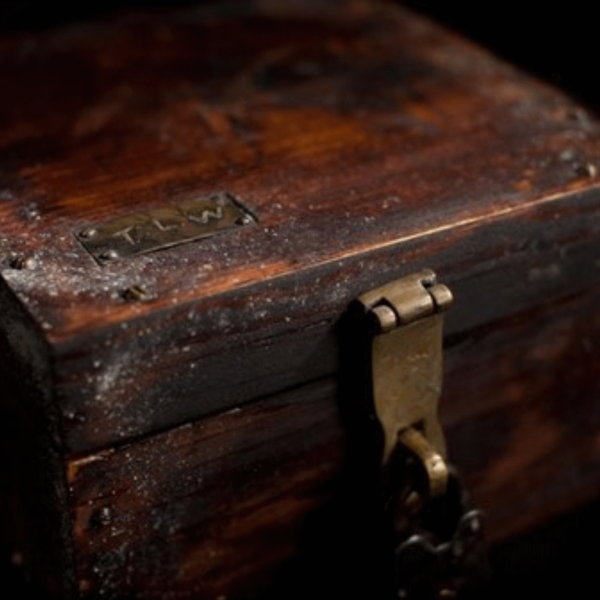

# ❓ DE VOLGENDE STAP ❓

Jullie vinden een mysterieuze oude houten doos. Deze doos zit vast met vier zware sloten:

&nbsp;|&nbsp;|&nbsp;
--- | --- | ---
C | Een cijferslot  |  0123…
L | Een letterslot  |  ABCD…
S | Een sleutelslot |  🔑
K | Een kaartslot   |  ♠️♣️♥️♦️

Om de doos te kunnen openen moeten jullie de codes en de sleutel zien te vinden van al deze sloten.  Deze codes moeten
worden doorgegeven door 1 van de 6 uitverkorenen in de “Wie is de Wolff?” Discord server die is aangemaakt door de
Moltubers.  **Maar kies wijs!  Als je een foute code doorgeeft voor een slot, dan kun je 24 uur lang niet meer een nieuwe
code voor datzelfde slot proberen.**

_Getallen, letters en kaartsoorten mogen in hun codes meerdere keren voorkomen._

Tip: Alle codes zijn 4 tekens lang

