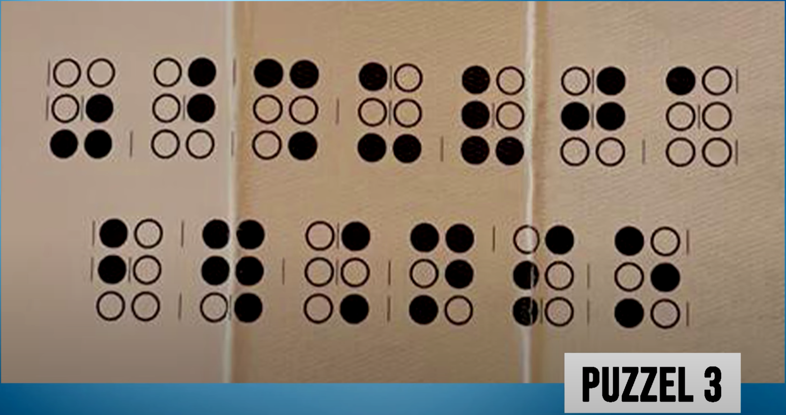

# Braille of niet

Bij deze puzzel lijkt het alsof de bolletjes braille zijn, maar hiermee kan de code niet worden gekraakt.  In
werkelijkheid is dit [morse](https://nl.wikipedia.org/wiki/Morse) en verdelen de licht grijze lijnen dit in letters.
Een wit bolletje staat voor een korte toon (punt) en een zwart bolletje stelt een lange toon (streep) voor.

Als we dit ontcijferen krijgen we `volgendeaanwijzingoptweeplekken`.  Dit betekent dat er niet alleen in de
boekenwinkel van [puzzel 2](./puzzel-2.md) een aanwijzing te vinden is, maar dat er dus ook op een andere plek zal
moeten worden gezocht.
