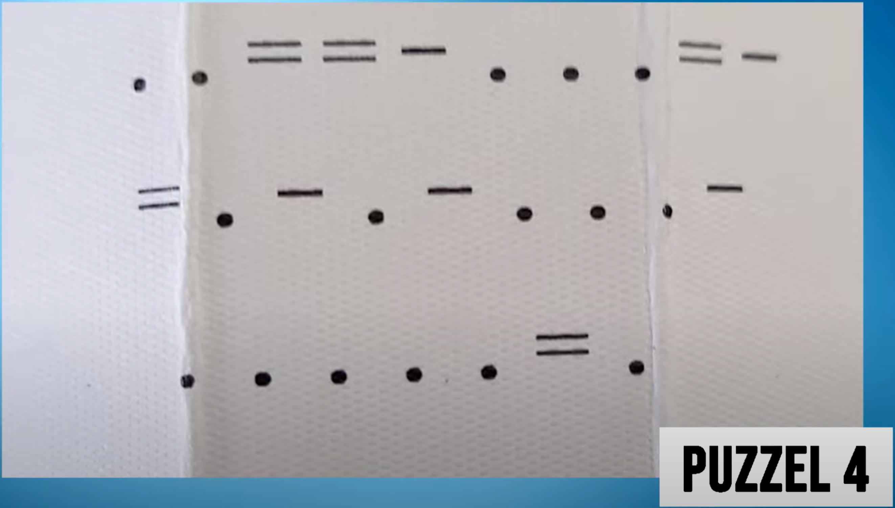

# Morse of niet

Bij deze puzzel lijkt het alsof de stippen en strepen een morse code vormen, maar hiermee kan de code niet worden
gekraakt.  In werkelijkheid is dit een toestenbord en moeten de getypte letters op de goede volgorde gelegd worden.
Hierbij moet je letters met een punt niet gebruiken, met een enkele streep een maal en met een dubbele streep twee keer.

Als je alle letters bij elkaar pakt, krijg je `eerrtoopaadglnn`.  De LWD die onderaan staat, verwijst naar Leeuwarden.
Daar bestaat het park “Noorderplantage”, dat precies dezelfde letters gebruikt.  Dit is de tweede plek waar een volgende
aanwijzing gevonden kan worden.
